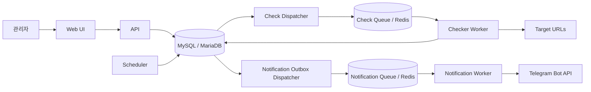

# LinkAlive 서비스 기획안

> 문서 상태: MVP 구현 완료 v1.0  
> 작성일: 2026-09-03  
> 목적: 여러 URL의 가용성을 주기적으로 확인하고, 장애와 복구를 Telegram으로 알리는 시스템의 MVP 범위와 구현 기준을 정한다.

## 1. 현재 프로젝트 상태

이 문서의 기본 전제인 단일 조직·공인 HTTP/HTTPS·최소 1분 주기 MVP가 구현되어 있다. Node.js/TypeScript pnpm workspace에 Web, API, scheduler, worker를 분리했고, MySQL/MariaDB 원장과 Redis/BullMQ 큐, Prisma migration, 테스트·CI, 로컬/운영 Compose 및 운영 안내서를 함께 제공한다.

실제 운영 전에는 배포 환경에 맞는 HTTPS reverse proxy, 관리형 MySQL/MariaDB 백업/PITR, Redis persistence와 외부 dead-man monitor를 구성해야 한다. 코드와 무관한 이 운영 항목은 [docs/OPERATIONS.md](./docs/OPERATIONS.md)의 배포 전 확인 절차를 따른다.

## 2. 서비스 목표

LinkAlive는 사용자가 등록한 HTTP/HTTPS URL을 정해진 간격으로 검사하고, 일시적인 네트워크 흔들림과 실제 장애를 구분해 알림을 보내는 서비스다.

핵심 목표는 다음과 같다.

1. URL별 검사 조건과 주기를 간단히 설정할 수 있다.
2. DNS, 연결, TLS, 응답 지연, HTTP 상태 코드, 콘텐츠 오류를 구분한다.
3. 연속 실패/성공 기준으로 장애와 복구를 안정적으로 판정한다.
4. Telegram으로 장애 및 복구 알림을 보내고 애플리케이션 수준에서 중복을 최대한 억제한다.
5. 현재 상태, 최근 검사 결과, 장애 이력을 관리 화면에서 확인한다.
6. 서비스 재시작이나 워커 중복 실행 중에도 검사와 알림이 유실되거나 과도하게 중복되지 않는다.

## 3. MVP 전제와 범위

운영 형태가 아직 정해지지 않았으므로 MVP는 다음을 기본 전제로 한다.

- 한 조직 또는 소수의 관리자 사용
- 한 지역에서 공인 인터넷의 HTTP/HTTPS URL 검사
- URL별 최소 검사 주기 1분
- Telegram 알림 지원
- 운영 배포 시 관리 UI/API 인증 필수(구현 방식은 Phase 0에서 확정)
- 브라우저 렌더링이 아닌 HTTP 요청 기반 검사
- 원본 응답 본문은 저장하지 않음
- 결제, 공개 상태 페이지, 다중 지역 검사, 조직별 과금은 후속 범위

### 3.1 MVP에 포함할 기능

#### 모니터 관리

- 모니터 등록, 조회, 수정, 삭제
- 이름, URL, 활성화 여부 설정
- 검사 주기 설정: 1분, 5분, 10분, 30분, 1시간
- 요청 방식 설정: 기본 `GET`, 필요 시 `HEAD`
- 전체 요청 제한 시간 설정: 기본 10초
- 기대 HTTP 상태 범위 설정: 기본 200~299
- 선택적 응답 키워드 포함 검사
- 리다이렉트 허용 여부 설정: 기본 허용, 최대 5회
- 연속 실패 횟수와 연속 복구 횟수 설정
- 모니터 일시 중지 및 즉시 검사
- 저장 전 또는 저장 직후 시험 검사
- 수동/시험 검사 결과는 별도 이력으로 남기되 자동 상태 전이에는 반영하지 않음

#### 대시보드와 이력

- 전체/정상/불안정/장애/중지 모니터 수
- 모니터별 현재 상태, 마지막 검사 시각, 응답 시간, 다음 검사 시각
- 최근 검사 결과와 오류 유형
- 장애 발생/복구 시각과 장애 지속 시간
- 알림 발송 성공/실패 상태

#### 알림

- Telegram 채팅 등록 및 시험 발송
- Telegram 채팅 연결 및 시험 발송
- 모니터별 알림 채널 연결
- 장애 발생 알림과 복구 알림
- 발송 실패 재시도와 최종 실패 기록

### 3.2 MVP에서 제외할 기능

- JavaScript 실행, 로그인 시나리오, 브라우저 화면 검사
- POST 요청이나 복잡한 API 시나리오
- 전 세계 다중 지역 검사와 지역별 합의 판정
- SMS, Slack, Discord, Webhook 알림
- 공개 상태 페이지와 SLA 리포트
- 장애 반복 알림, 유지보수 시간, 운영자 확인/에스컬레이션
- 고급 인증 헤더/쿠키 저장
- 결제, 플랜, 사용량 과금

## 4. 정상·장애 판정 정책

### 4.1 한 번의 검사 성공 조건

아래 조건을 모두 만족하면 해당 검사는 성공이다.

1. DNS 조회와 TCP/TLS 연결이 제한 시간 안에 완료된다.
2. TLS 인증서가 유효하고 요청 호스트와 일치한다.
3. 최종 응답 헤더와 필요한 본문 검사 범위를 전체 제한 시간 안에 처리한다.
4. 리다이렉트를 따르는 경우 마지막 응답의 HTTP 상태 코드가 설정된 기대 범위에 포함된다.
5. 키워드 검사가 설정된 경우 제한된 본문 안에서 키워드가 발견된다.

기본 기대 범위는 200~299다. 리다이렉트는 기본적으로 최대 5회까지 따르고 최종 응답을 판정한다. 리다이렉트를 끈 모니터에서 받은 3xx는 사용자가 3xx를 기대 범위에 명시하지 않는 한 실패다.

키워드 검사가 없으면 최종 응답 헤더 수신 시 검사를 종료한다. 키워드 검사가 있으면 압축 해제 후 본문을 스트리밍으로 최대 64KB까지 읽으며, 그 안에서 키워드를 찾지 못하면 `CONTENT_MISMATCH`로 처리하고 연결을 중단한다. `HEAD`와 키워드 검사는 동시에 설정할 수 없다. 대시보드 응답 시간은 최종 응답 헤더까지의 `ttfb_ms`를 사용하고, 전체 검사 수행 시간은 `total_ms`로 따로 기록한다. 쿠키는 보관하지 않으며 JavaScript는 실행하지 않는다.

### 4.2 상태 정의

생명주기와 건강 상태를 하나의 필드에 섞지 않는다.

| 생명주기 상태 | 의미                                  |
| ------------- | ------------------------------------- |
| `ACTIVE`      | 자동 검사 수행 중                     |
| `PAUSED`      | 사용자가 자동 검사를 일시 중지함      |
| `DELETED`     | soft delete되어 더 이상 검사하지 않음 |

| 건강 상태    | 의미                                                    |
| ------------ | ------------------------------------------------------- |
| `PENDING`    | 등록 후 아직 정상 여부가 확정되지 않음                  |
| `UP`         | 최근 검사들이 정상임                                    |
| `SUSPECT`    | 실패가 감지됐지만 장애 임계치에는 도달하지 않음         |
| `DOWN`       | 연속 실패 임계치에 도달해 장애가 확정됨                 |
| `RECOVERING` | 장애 후 성공이 감지됐지만 복구 임계치에는 도달하지 않음 |

`STALE`은 DB에 저장하는 건강 상태가 아니라 `현재 시각 > next_check_at + max(검사 주기 × 2, 5분)`일 때 UI에서 계산하는 운영 경고다. 대상 장애가 아니라 LinkAlive 내부 이상 가능성을 뜻하며 대상 incident나 사용자 장애 알림을 만들지 않는다.

### 4.3 권장 기본값

- 검사 주기: 1분
- DNS timeout: 2초
- 연결 타임아웃: 3초
- TLS handshake timeout: 3초
- 첫 바이트 timeout: 5초
- 전체 타임아웃: 10초
- 최대 응답 헤더: 32KB
- 압축 해제 후 본문 검사 한도: 64KB
- 기대 상태 코드: 200~299
- 장애 확정: 연속 3회 실패
- 복구 확정: 연속 2회 성공
- 리다이렉트: 기본 허용, 최대 5회, HTTP/HTTPS 전환 허용
- 한 검사 안에서의 HTTP 재시도: 없음(일시 오류는 연속 실패 임계치로 흡수)
- 알림 재시도: 최대 3회, 지수 백오프와 무작위 지연 적용

단계별 timeout과 크기 제한은 MVP에서는 시스템 전역의 강제 상한으로 둔다. 모니터별로는 전체 timeout만 허용 범위 안에서 낮출 수 있게 한다. 하위 단계 제한은 항상 전체 timeout 안에서 강제 취소되어야 한다.

### 4.4 상태 전이 규칙

상태 전이에는 `SCHEDULED` 검사 중 현재 `config_version`과 일치하고 결과가 `SUCCESS` 또는 `TARGET_FAILURE`인 한 건만 참여한다. `MANUAL`, `TEST`, `PLATFORM_ERROR`, `INCONCLUSIVE`, 오래된 설정의 결과는 이력만 남기고 상태와 카운터를 바꾸지 않는다.

1. 성공하면 `consecutive_failures`를 0으로 초기화한다.
2. `PENDING`, `UP`, `SUSPECT`에서 성공하면 즉시 `UP`이 된다.
3. `DOWN` 또는 `RECOVERING`에서 성공하면 `consecutive_successes`를 증가시킨다. 복구 임계치 미만이면 `RECOVERING`, 도달하면 `UP`으로 바꾸고 incident를 해결한다.
4. 대상 실패면 `consecutive_successes`를 0으로 초기화하고 `consecutive_failures`를 증가시킨다.
5. `PENDING`, `UP`, `SUSPECT`에서 실패 임계치 미만이면 `SUSPECT`, 도달하면 즉시 `DOWN`으로 바꾸고 열린 incident가 없을 때만 새 incident를 만든다.
6. `DOWN`에서 다시 실패하면 `DOWN`을 유지하고, `RECOVERING`에서 실패하면 `DOWN`으로 돌아간다.
7. 실패/복구 임계치는 최소 1이다. 값이 1이면 첫 대상 실패 또는 첫 복구 성공에서 바로 전이한다.
8. 일시 중지 또는 삭제 시 열린 incident는 각각 `PAUSED`, `DELETED` 사유로 `CANCELED` 처리하고 대기 중인 알림을 취소하며 복구 알림은 보내지 않는다.
9. URL, 요청 방식, 정상 조건처럼 판정 의미를 바꾸는 설정이 수정되면 `config_version`을 올리고 카운터를 초기화한다. 열린 incident는 `CONFIG_CHANGED` 사유로 `CANCELED` 처리하며 건강 상태는 `PENDING`에서 다시 시작한다. 이름이나 알림 채널만 바뀐 경우에는 상태를 초기화하지 않는다.
10. 실행 전과 결과 저장 트랜잭션 안에서 `config_version`을 모두 확인한다. 요청 중 설정이 바뀐 결과는 이력만 남기고 상태, incident, 알림에는 반영하지 않는다.

`SUSPECT` 단계에서는 알림을 보내지 않는다. `DOWN` 진입 시 채널별 장애 발송 이벤트를 만들며, 복구 시에는 같은 채널의 장애 알림 전달 상태에 따라 복구 이벤트를 처리한다. 자세한 순서 규칙은 10.2절을 따른다.

### 4.5 오류 분류

검사 결과의 상위 `outcome`은 `SUCCESS`, `TARGET_FAILURE`, `PLATFORM_ERROR`, `INCONCLUSIVE`로 먼저 구분한다. 아래 `error_type`은 실패 원인을 더 자세히 설명한다.

- `DNS_ERROR`: 도메인 조회 실패 또는 시간 초과
- `CONNECT_TIMEOUT`: 대상 서버 연결 시간 초과
- `CONNECTION_REFUSED`: 연결 거절
- `TLS_ERROR`: 인증서, 호스트명, 핸드셰이크 오류
- `TTFB_TIMEOUT`: 첫 바이트 응답 시간 초과
- `REQUEST_TIMEOUT`: 본문 검사를 포함한 전체 요청 시간 초과
- `REDIRECT_ERROR`: 제한 초과, 순환 또는 금지된 목적지
- `HTTP_STATUS_MISMATCH`: 기대하지 않은 상태 코드
- `CONTENT_MISMATCH`: 기대 키워드 없음
- `RESPONSE_LIMIT_EXCEEDED`: 응답 헤더나 안전한 처리 한도 초과
- `NETWORK_ERROR`: 기타 네트워크 오류
- `PLATFORM_ERROR`: DB, 큐, 워커 등 LinkAlive 자체 오류

`PLATFORM_ERROR`와 `INCONCLUSIVE` outcome은 대상 URL의 실패 횟수에 포함하지 않는다. 모니터링 시스템 자체 문제로 인해 검사하지 못한 상태와 실제 대상 장애를 반드시 구분한다.

## 5. 사용자 흐름

### 5.1 모니터 등록

1. 사용자가 이름, URL, 주기, 타임아웃, 정상 조건을 입력한다.
2. 서버가 URL 형식과 보안 정책을 검증한다.
3. 시험 검사를 수행해 결과를 보여준다.
4. 사용자가 알림 채널을 연결하고 모니터를 활성화한다.
5. 스케줄러가 `next_check_at` 기준으로 DB 검사 원장을 만들고 dispatcher가 첫 검사를 큐에 등록한다.

### 5.2 장애 발생

1. 워커가 검사 결과와 상세 오류를 저장한다.
2. 연속 실패가 임계치에 도달하면 하나의 incident를 연다.
3. 같은 DB 트랜잭션에서 발송할 알림 이벤트를 outbox에 기록한다.
4. 알림 워커가 Telegram으로 장애 알림을 발송한다.
5. 발송 결과를 기록하고 실패 시 정해진 횟수만 재시도한다.

### 5.3 복구

1. 장애 상태에서 연속 성공 임계치에 도달하면 incident를 닫는다.
2. 장애 지속 시간을 계산한다.
3. 장애 알림 전달 상태와 채널별 순서 정책에 따라 복구 알림 이벤트를 처리한다.
4. 대시보드 상태와 이력을 갱신한다.

## 6. 권장 시스템 구성

MVP는 배포 단위는 나눌 수 있지만 코드와 데이터 모델은 함께 관리하는 **모듈형 모놀리스**로 시작한다. 마이크로서비스를 먼저 도입하기보다 API, 스케줄러, 검사 워커, 알림 워커의 책임과 프로세스만 분리한다.



### 6.1 컴포넌트 책임

| 컴포넌트            | 책임                                                                                |
| ------------------- | ----------------------------------------------------------------------------------- |
| Web UI              | 모니터/알림 설정, 상태와 이력 조회                                                  |
| API                 | 인증, 입력 검증, CRUD, 수동 검사 요청, 조회 API                                     |
| Scheduler           | 실행 시각이 된 모니터를 선점해 DB에 내구성 있는 검사 작업을 생성하고 다음 시각 갱신 |
| Check Dispatcher    | 미전달 검사 작업을 Redis 큐에 넣고 누락 작업을 재조정                               |
| Checker Worker      | 안전한 HTTP 요청, 결과 측정, 상태 전이와 incident 처리                              |
| Outbox Dispatcher   | DB에 확정된 알림 이벤트를 알림 큐로 전달                                            |
| Notification Worker | Telegram 발송, 재시도, 발송 결과 기록                                               |
| MySQL/MariaDB       | 설정, 상태, 검사 작업 원장, 결과, incident, 알림 outbox의 기준 데이터               |
| Redis/BullMQ        | 재생 가능한 검사/알림 작업의 분산 실행, 지연 및 재시도                              |

### 6.2 권장 기술 스택

| 영역         | 권장안                          | 선정 이유                                              |
| ------------ | ------------------------------- | ------------------------------------------------------ |
| Runtime      | Node.js 활성 LTS + TypeScript   | 현재 Node 프로젝트 흐름 유지, 네트워크 I/O 워커에 적합 |
| Package 관리 | pnpm workspace                  | 여러 앱과 공통 패키지 관리 용이                        |
| API          | NestJS + Fastify adapter        | 모듈, 검증, DI, 워커 구조를 명확히 유지                |
| Web          | Next.js                         | 관리 화면과 API 연동, 향후 인증 확장 용이              |
| ORM/DB       | Prisma + MySQL/MariaDB          | 기존 운영 DB 재사용, 명시적인 migration과 트랜잭션     |
| Queue        | BullMQ + Redis                  | 지연 작업, 재시도, 동시성 제어 지원                    |
| Telegram     | Telegram Bot API                | bot token과 chat ID 기반 발송                          |
| Logging      | Pino 기반 JSON 로그             | 빠르고 구조화된 운영 로그                              |
| Test         | Vitest + CI MariaDB/Redis smoke | 단위 테스트와 실제 인프라 기반 핵심 흐름 검증          |
| Local infra  | Docker Compose                  | MariaDB와 Redis를 동일하게 재현                        |

정확한 Node.js 버전과 pnpm 버전은 프로젝트 초기화 시 고정한다. 초기 규모가 매우 작다면 Web UI 없이 API와 간단한 관리자 화면으로 시작할 수 있지만, 스케줄러와 워커는 웹 요청 프로세스와 분리해야 한다.

### 6.3 권장 디렉터리 구조

```text
LinkAlive/
├─ apps/
│  ├─ api/                 # REST API
│  ├─ web/                 # 관리 화면
│  ├─ scheduler/           # due monitor 탐색 및 작업 생성
│  └─ worker/              # URL 검사 및 알림 작업
├─ packages/
│  ├─ domain/              # 상태 머신, 정책, 오류 타입
│  ├─ database/            # Prisma schema/client
│  ├─ monitoring/          # 안전한 HTTP checker
│  └─ notifications/       # Telegram adapter
├─ infra/
│  ├─ compose.yaml         # 로컬 MariaDB/Redis
│  ├─ compose.app.yaml     # 로컬 전체 애플리케이션 구성
│  └─ compose.prod.yaml    # 외부 관리형 DB/Redis 운영 구성
├─ docs/                   # 상세 설계와 운영 문서
├─ Dockerfile              # API/Web/Scheduler/Worker 멀티 스테이지 이미지
├─ .env.example
├─ .gitignore
├─ package.json
└─ pnpm-workspace.yaml
```

구현에서는 `scheduler`와 `worker`를 별도 앱으로 분리했다. 하나의 worker 프로세스가 검사와 알림 consumer를 함께 구동하며, 트래픽이 증가하면 역할별 실행 모드를 추가해 검사 consumer를 독립적으로 수평 확장할 수 있다.

## 7. 스케줄링과 중복 방지 설계

URL마다 개별 cron을 만들지 않고 중앙 스케줄러가 DB의 `next_check_at`을 기준으로 실행 대상을 찾는다. MySQL/MariaDB의 `scheduled_checks`를 내구성 있는 작업 원장으로 삼고 Redis는 실행을 빠르게 분산하는 계층으로만 사용한다.

1. 스케줄러는 due monitor를 DB lock/lease로 선점하고, 하나의 트랜잭션에서 `scheduled_checks` 생성과 다음 `next_check_at` 갱신을 함께 처리한다.
2. 예약 작업 고유 키는 `(monitor_id, scheduled_at, config_version)`이며 DB unique 제약을 둔다.
3. Check Dispatcher는 `PENDING` 작업을 `job_id = scheduled_check.id`로 Redis에 등록한다. 등록 과정에서 종료되더라도 DB 원장은 남으므로 다시 시도할 수 있다.
4. reconciliation 작업은 결과가 없고 lease가 만료된 `PENDING`, `ENQUEUED`, `RUNNING` 작업을 주기적으로 찾아 재등록하거나 안전하게 종료한다. Redis 데이터가 사라져도 DB 원장에서 복구한다.
5. 동일 모니터에는 활성 예약 작업이 하나만 존재하도록 해 검사가 겹치지 않게 한다. 비정상 종료된 작업은 lease 만료 후에만 다시 실행한다.
6. 큐 작업은 at-least-once 실행될 수 있다. 중복 워커 중 `scheduled_check` 완료를 처음 확정한 한 작업만 결과와 상태 전이 트랜잭션을 적용하고 나머지는 중복으로 종료한다.
7. 실행 직전과 결과 저장 시 `config_version` 및 생명주기 상태를 다시 확인한다. 모니터 수정/중지/삭제 뒤 남은 작업 결과는 상태 전이에 반영하지 않는다.
8. 모든 검사가 정각에 몰리지 않도록 모니터 ID 기반의 안정적인 jitter를 적용한다.
9. 장시간 중단 후 복구되면 놓친 모든 검사를 재생하지 않고 최신 검사 하나만 예약한다.
10. 다음 예약 시각은 실제 완료 시각이 아니라 원래 예정 시각을 기준으로 계산해 장기적인 schedule drift를 막는다.

유효한 검사 결과 저장, 예약 작업 완료, 모니터 상태 갱신, incident 생성, 알림 outbox 생성은 하나의 DB 트랜잭션으로 처리한다. 열린 incident는 모니터마다 최대 하나만 존재하도록 부분 unique 제약을 둔다.

## 8. 데이터 모델 초안

| 테이블                    | 주요 필드                                                                                                                                                                                                                                                                                 | 설명                                                    |
| ------------------------- | ----------------------------------------------------------------------------------------------------------------------------------------------------------------------------------------------------------------------------------------------------------------------------------------- | ------------------------------------------------------- |
| `monitors`                | `id`, `name`, `request_url_encrypted`, `display_url`, `hostname_normalized`, `method`, `interval_sec`, `timeout_ms`, `expected_status_min/max`, `expected_keyword`, `lifecycle_status`, `health_state`, `failure_count`, `success_count`, `next_check_at`, `config_version`, `deleted_at` | 암호화된 실제 요청 URL, 마스킹 표시값, 설정과 현재 상태 |
| `scheduled_checks`        | `id`, `monitor_id`, `scheduled_at`, `config_version`, `status`, `lease_until`, `queue_job_id`, `attempt_count`, `created_at`, `completed_at`                                                                                                                                              | Redis에서 재생 가능한 예약 검사 작업 원장               |
| `check_results`           | `id`, `monitor_id`, `scheduled_check_id`, `source`, `outcome`, `config_version`, `started_at`, `finished_at`, `status_code`, `ttfb_ms`, `total_ms`, `error_type`, `error_message_safe`, `worker_region`                                                                                   | 자동/수동/시험 및 대상/플랫폼 결과를 구분한 검사 이력   |
| `incidents`               | `id`, `monitor_id`, `status`, `first_failure_at`, `detected_at`, `resolved_at`, `first_error_type`, `last_error_type`, `closure_reason`                                                                                                                                                   | 최초 실패와 장애 확정 시점을 구분한 장애 단위 이력      |
| `notification_channels`   | `id`, `type`, `display_name`, `encrypted_config`, `verified_at`, `enabled`                                                                                                                                                                                                                | Telegram 채널                                           |
| `monitor_channels`        | `monitor_id`, `channel_id`, `notify_on_down`, `notify_on_recovery`                                                                                                                                                                                                                        | 모니터와 채널 연결                                      |
| `notification_outbox`     | `id`, `incident_id`, `channel_id`, `event_type`, `sequence`, `dedupe_key`, `payload_safe`, `status`, `available_at`                                                                                                                                                                       | 채널별 순서와 유실 방지를 위한 발송 이벤트              |
| `notification_deliveries` | `id`, `outbox_id`, `attempt`, `status`, `message_id`, `provider_message_id`, `error_safe`, `sent_at`                                                                                                                                                                                      | 채널별 실제 발송 시도와 성공 여부                       |
| `audit_logs`              | `id`, `actor_id`, `action`, `target_type`, `target_id`, `created_at`                                                                                                                                                                                                                      | 설정 변경 감사 로그                                     |

`scheduled_checks`의 `(monitor_id, scheduled_at, config_version)`과 `check_results.scheduled_check_id`에 unique 제약을 둔다. 중복 워커 중 결과 insert에 성공한 한 작업만 같은 트랜잭션에서 실패/성공 카운터와 incident를 변경한다. `source`는 `SCHEDULED | MANUAL | TEST`, `outcome`은 `SUCCESS | TARGET_FAILURE | PLATFORM_ERROR | INCONCLUSIVE`로 구분한다.

incident `status`는 `OPEN | RESOLVED | CANCELED`로 구분한다. 일시 중지, 삭제, 판정 설정 변경으로 닫힌 incident는 `CANCELED`와 구체적인 `closure_reason`을 기록해 실제 복구와 구분한다.

URL query에는 API key 같은 비밀이 들어갈 수 있으므로 실제 요청 URL 전체를 암호화해 저장하고, 목록·로그·알림·outbox에는 query를 제거하거나 값이 마스킹된 `display_url`만 사용한다. MVP에서는 URL 외 별도 인증 헤더 저장은 지원하지 않는다.

인증이 필요한 공개형 서비스라면 처음부터 `users`, `workspaces`, `workspace_members`와 모든 업무 데이터의 `workspace_id`를 추가한다. 사내 단일 운영 도구라면 인증은 SSO/reverse proxy에 맡기고 위 모델을 단순화할 수 있다. 이 선택은 구현 전에 확정해야 한다.

### 8.1 보존 정책 권장안

- 상세 검사 결과: 30일
- incident와 알림 발송 이력: 1년
- 30일이 지난 검사 결과: 시간/일 단위 집계만 보존하는 기능을 후속 추가
- 삭제된 모니터의 관련 데이터: 정책에 따라 즉시 삭제 또는 제한 기간 후 정리
- 모든 시각은 UTC로 저장하고 UI에서 사용자 시간대로 표시

## 9. API 초안

```text
GET    /api/v1/monitors
POST   /api/v1/monitors
POST   /api/v1/monitors/test
GET    /api/v1/monitors/:id
PATCH  /api/v1/monitors/:id
DELETE /api/v1/monitors/:id
POST   /api/v1/monitors/:id/pause
POST   /api/v1/monitors/:id/resume
POST   /api/v1/monitors/:id/check-now
GET    /api/v1/monitors/:id/checks
GET    /api/v1/monitors/:id/incidents

GET    /api/v1/incidents
GET    /api/v1/incidents/:id

GET    /api/v1/notification-channels
POST   /api/v1/notification-channels
PATCH  /api/v1/notification-channels/:id
DELETE /api/v1/notification-channels/:id
POST   /api/v1/notification-channels/:id/test

GET    /api/v1/dashboard/summary
GET    /health/live
GET    /health/ready
```

`POST /api/v1/monitors/test`는 아직 저장하지 않은 설정의 시험 검사, `check-now`는 저장된 모니터의 수동 검사에 사용한다. 두 요청 모두 사용자별/목적지별 호출 제한과 정기 검사와 동일한 보안 검증을 적용하며 건강 상태에는 반영하지 않는다. 모든 관리 API는 인증을 요구하고, 목록/이력 API는 cursor pagination을 사용한다.

## 10. 알림 설계

### 10.1 알림 내용

- 모니터 이름
- query string을 제외하거나 마스킹한 대상 URL
- 장애/복구 발생 시각
- 오류 분류와 안전하게 정리한 오류 설명
- 최근 상태 코드와 응답 시간
- 장애 지속 시간(복구 알림)
- 관리 화면 링크

인증 헤더, URL의 비밀 값, 응답 본문, Telegram token은 알림과 로그에 포함하지 않는다.

### 10.2 중복과 유실 방지

- 장애 이벤트 고유 키 예시: `incident_id + channel_id + DOWN`
- 복구 이벤트 고유 키 예시: `incident_id + channel_id + RECOVERY`
- `dedupe_key`에 DB unique 제약 적용
- DB commit 후 outbox dispatcher가 발송 큐로 전달
- Redis 작업이 사라져도 DB의 미완료 outbox를 reconciliation하여 다시 등록
- 한 incident의 채널별 이벤트에 sequence를 두고 `DOWN` 처리 전 `RECOVERY`가 앞서 발송되지 않게 함
- `DOWN`이 성공한 채널에만 `RECOVERY`를 발송함. `DOWN`이 최종 실패하면 해당 채널에는 `RECOVERY`도 보내지 않고 운영 화면에 표시
- incident가 `DOWN` 발송 시도 전에 복구되면 두 메시지 대신 `RESOLVED_SUMMARY` 한 건으로 합침. 발송을 이미 시도했다면 기존 순서를 유지
- incident 개설 시 연결된 채널과 목적지의 안전한 스냅샷을 사용하고, 이후 binding 변경은 다음 incident부터 적용. 단, 채널 자체를 비활성화/삭제하면 대기 발송을 취소
- 제공자 timeout 시 실제 전달 여부가 불명확할 수 있으므로 재시도에도 같은 Message-ID를 사용하고 제공자 응답 ID를 기록
- 알림 발송 실패가 모니터의 장애 판정에 영향을 주지 않도록 분리

내부 outbox 이벤트 생성과 소비는 unique key로 멱등 처리한다. 다만 Telegram 제공자가 메시지는 받았지만 응답 전에 timeout이 난 경우에는 완전한 exactly-once를 보장할 수 없다. 외부 전달 의미는 **at-least-once**이며, 고정 발송 식별자와 발송 이력으로 드문 중복을 억제하고 추적한다.

### 10.3 제공자별 고려 사항

- Telegram: bot token 암호화, chat 연결 확인, 봇 차단/채팅 퇴장 감지
- 시험 발송: 호출 제한과 감사 로그 적용

## 11. 보안 원칙

URL 모니터링은 서버가 사용자가 입력한 주소로 요청을 보내므로 URL 등록 권한은 신뢰할 수 있는 관리자에게만 제공한다.

### 11.1 URL/네트워크 보호

- `http:`와 `https:` URL을 허용하며 URL 기본 인증 정보는 암호화해 저장하고 화면에는 표시하지 않음
- localhost, 사설망, 예약 대역과 사용자 지정 포트를 포함한 모든 HTTP(S) 목적지를 허용
- IPv4, IPv6, IPv4-mapped IPv6와 비표준 IP 표현을 모두 정규화해 검사
- 등록 시뿐 아니라 **매 검사와 모든 리다이렉트 단계에서** DNS 결과와 목적지를 재검증
- 검증한 IP로 실제 연결을 고정하고 원래 호스트명은 HTTP Host와 TLS SNI에 유지해 DNS rebinding을 차단
- 다른 origin으로 리다이렉트될 때 인증 관련 헤더를 전달하지 않음
- HTTP와 HTTPS 사이의 리다이렉트를 허용하되 단계마다 DNS를 다시 확인
- 모니터링 워커의 네트워크를 DB/관리망/metadata endpoint와 격리
- 사용자, 도메인, 목적지 IP별 검사 빈도와 동시 연결 수 제한

내부 URL과 metadata 주소에도 접근할 수 있으므로 worker의 네트워크 권한을 최소화하고 관리자 계정을 외부에 노출하지 않는다.

### 11.2 자원과 비밀 보호

- DNS, 연결, TLS, 첫 바이트, 전체 요청에 상한 설정
- 응답 헤더와 압축 해제 후 본문 크기 제한
- 무한 스트림과 느린 응답을 전체 타임아웃에서 강제 취소
- secret은 환경 변수/secret manager로 주입하고 DB 저장 시 애플리케이션 레벨 암호화
- 로그, trace, metric label에서 query string, chat ID, token, 헤더를 마스킹
- 원본 응답 본문과 인증 정보는 기본 저장하지 않음
- 관리자 설정 변경은 감사 로그에 기록

## 12. 관측성과 운영

### 12.1 수집할 지표

- 예정된 검사 대비 실제 수행률
- 성공/실패 수와 오류 유형별 비율
- 요청 응답 시간 분포
- 스케줄 지연 시간과 큐 대기 시간
- 큐 깊이, 워커 동시 실행 수, 재시도 수
- incident 발생부터 첫 알림까지의 시간
- Telegram 발송 성공률과 지연
- DB/Redis 연결 상태와 outbox 적체량

로그에는 `monitor_id`, `check_id`, `incident_id`, `notification_id` 같은 내부 식별자를 넣어 한 흐름을 추적할 수 있게 한다. URL 전체 문자열은 metric label로 사용하지 않는다.

### 12.2 잠정 SLO

- 검사 수행률: 예약 시각 기준 허용 지연 내 99.9%
- 장애 판정 후 첫 알림 큐 등록: 30초 이내 99%
- 알림 제공자 정상 상태에서 발송 시도: 60초 이내 99%
- LinkAlive 자체 장애를 외부 dead-man monitor로 감지

이 값은 실제 모니터 수, 최소 주기, 배포 환경을 확정한 뒤 조정한다.

### 12.3 장애 대응 원칙

- 큐/DB 장애로 검사를 못 한 경우 대상 URL을 `DOWN`으로 바꾸지 않는다.
- 스케줄러 heartbeat와 “최근 생성된 검사 작업 시각”을 별도로 감시한다.
- Redis 복구 후 오래된 작업을 한꺼번에 실행하지 않는다.
- 알림 제공자 장애는 dead-letter queue와 운영 경고로 분리한다.
- LinkAlive 자체 health endpoint는 외부 시스템에서도 감시한다.

## 13. 배포 구성

### 13.1 로컬 개발

- 애플리케이션 프로세스는 로컬 실행
- MariaDB와 Redis는 Docker Compose로 실행
- Telegram은 개발 전용 bot/chat 사용

### 13.2 운영

- `web`, `api`, `scheduler`, `worker`를 별도 컨테이너로 실행한다. MVP worker 안에서는 검사 큐와 알림 큐 consumer를 논리적으로 분리해 함께 실행하며, 규모가 커지면 동일 코드를 역할별 프로세스로 분리한다.
- MySQL/MariaDB는 자동 백업이 가능한 관리형 서비스 권장
- Redis는 적절한 persistence와 가용성을 구성하되 기준 데이터로 간주하지 않음. 검사 원장과 알림 outbox를 주기적으로 reconciliation해 유실 작업을 재등록
- 검사 워커는 부하에 따라 수평 확장
- 무중단 배포 중 구버전 작업을 구분할 수 있도록 작업 payload에 `config_version` 포함
- 지속 실행 프로세스가 필요하므로 순수 요청형 serverless만으로 구성하지 않음

초기 용량 산정은 다음 식으로 시작한다.

```text
평균 초당 검사 수 = 활성 모니터 수 / 평균 검사 주기(초)
필요 동시성 ≈ 초당 검사 수 × p95 검사 소요 시간(초) × 여유 계수
```

예를 들어 1분 주기 모니터 1,000개는 평균 약 16.7건/초이며, 하루 약 144만 건의 검사 결과를 만든다. 실제 설계에서는 jitter, 장애 시 지연, DB 쓰기량, 알림 피크를 함께 반영한다.

## 14. 테스트 전략

### 14.1 단위 테스트

- `UP → SUSPECT → DOWN → RECOVERING → UP` 상태 머신
- 실패/복구 카운터와 incident 생성 조건
- 알림 dedupe key와 채널별 이벤트 순서 계산
- URL/IP/리다이렉트 보안 정책
- 오류 분류와 민감 정보 마스킹
- 임계치 1, 설정 변경 중 검사 완료, 수동 검사 미반영 조건

### 14.2 통합 테스트

- MySQL/MariaDB 트랜잭션과 열린 incident 유일성
- Redis 작업 중복·유실, DB 작업 원장 재조정, lease 만료
- outbox 처리 중 프로세스 종료 후 재개
- Telegram provider adapter 성공, 제한, timeout
- 동적 DNS 및 리다이렉트 목적지 재검증

### 14.3 E2E/장애 주입 시나리오

- 정상, 4xx/5xx, NXDOMAIN, 연결 거절, 느린 응답, 무한 스트림
- 인증서 만료, 자체 서명, 호스트명 불일치
- 리다이렉트 순환과 HTTP/HTTPS·사설 IP 목적지 리다이렉트
- `HEAD`와 키워드 동시 설정 거부, 3xx 최종 응답 판정
- 두 워커가 같은 작업을 동시에 받는 상황
- 장애 판정/알림 직전과 직후 프로세스 종료
- 성공과 실패가 짧게 반복되는 flapping
- 스케줄러 중단 후 backlog 복구
- DB/Redis 장애가 대상 URL 장애로 잘못 기록되지 않는지 검증
- 인증되지 않은 관리/수동 검사 요청 차단과 URL query 비밀값 유출 방지

## 15. 단계별 개발 계획

### Phase 0. 기반 구성

- workspace와 TypeScript 프로젝트 초기화
- 운영 인증 방식 결정 및 기본 인증/인가 골격 구성
- 환경 변수 스키마, `.env.example`, `.gitignore`
- MariaDB/Redis 로컬 환경과 migration 체계
- lint, format, unit test, CI
- health check와 구조화 로그

**완료 기준:** 새 환경에서 문서화된 한 번의 절차로 설치, 테스트, 로컬 실행이 가능하다.

### Phase 1. 모니터와 단일 검사

- monitor CRUD와 입력 검증
- 인증된 관리 API와 권한 검증
- 임의 HTTP(S) 목적지와 사용자 지정 포트를 지원하는 HTTP checker
- 검사 결과 저장과 오류 분류
- 저장 전 시험 검사와 저장 후 즉시 검사 API

**완료 기준:** 공인·사설·localhost HTTP(S) URL을 등록하고 수동 검사 결과를 조회할 수 있다.

### Phase 2. 스케줄러와 장애 판정

- `next_check_at` 기반 scheduler
- `scheduled_checks` 작업 원장, Check Dispatcher, reconciliation
- BullMQ 검사 큐와 checker worker
- 상태 머신, 연속 실패/복구 정책
- incident와 outbox 트랜잭션

**완료 기준:** 재시작, 중복 작업, Redis 작업 유실 상황에서도 DB 원장에서 주기 검사를 복구하고 incident가 중복 생성되지 않는다.

### Phase 3. Telegram

- 알림 채널 CRUD와 검증/시험 발송
- provider adapter, 알림 큐, 재시도, dead-letter 처리
- 채널별 장애/복구 순서 보장과 애플리케이션 수준 중복 억제

**완료 기준:** 하나의 incident에 대한 채널별 내부 발송 이벤트가 중복 생성되지 않고 순서대로 처리되며, 외부 제공자에는 at-least-once로 전달을 시도하고 모든 성공·실패·불명확한 timeout 이력이 남는다.

### Phase 4. 관리 화면과 이력

- 요약 대시보드
- 모니터 설정/일시 중지/즉시 검사 화면
- 검사 결과, incident, 알림 발송 이력
- 오류 필터와 시간대 표시

**완료 기준:** 운영자가 별도 DB 접근 없이 서비스 상태와 알림 실패 원인을 확인할 수 있다.

### Phase 5. 운영 안정화

- metric, dashboard, alert, dead-man monitor
- 부하/장애 주입/보안 테스트
- 데이터 보존 배치와 백업/복구 검증
- 배포 및 rollback 절차, 운영 runbook

**완료 기준:** 목표 규모의 부하 테스트와 핵심 장애 시나리오를 통과하고 운영 경보와 복구 절차가 준비된다.

## 16. MVP 완료 조건

- [x] URL을 등록, 수정, 중지, 삭제할 수 있다.
- [x] 운영 환경에서 인증되지 않은 사용자는 관리 UI/API와 수동 검사 API에 접근할 수 없다.
- [x] 설정된 주기에 따라 자동 검사가 계속된다.
- [x] DNS/TLS/timeout/상태 코드/콘텐츠 오류가 구분된다.
- [x] 기본 3회 연속 실패 후 incident가 하나만 생성된다.
- [x] Telegram 채널별 내부 장애 이벤트가 멱등하게 생성되고 외부에는 at-least-once로 전달을 시도한다.
- [x] 기본 2회 연속 성공 후 채널별 정책에 맞는 복구 이벤트가 생성되고 장애 알림보다 먼저 발송되지 않는다.
- [x] 재시작, 작업 중복, Redis 데이터 유실 후에도 DB 원장에서 작업을 복구하며 상태와 알림이 일관된다.
- [x] localhost, 사설 IP, metadata endpoint와 사용자 지정 포트를 등록하고 검사할 수 있다.
- [x] 실제 요청 URL은 암호화되고 query 값은 화면·로그·알림·outbox에서 마스킹된다.
- [x] 대시보드에서 현재 상태, 검사 이력, incident, 발송 실패를 확인할 수 있다.
- [x] 비밀 값과 응답 본문이 로그에 노출되지 않는다.
- [x] 자동 테스트, health check, 운영 지표, 백업 절차가 준비된다.

## 17. 구현 전 확정할 질문

아래 질문은 전체 구조 또는 데이터 모델에 영향을 주므로 Phase 0 전에 확정하는 것이 좋다.

1. 사내 단일 관리자 도구인가, 여러 사용자/조직이 가입하는 서비스인가?
2. 공인 인터넷 URL만 검사하면 되는가, 사내망 URL도 필요한가?
3. 예상 모니터 수와 반드시 필요한 최소 검사 주기는 얼마인가?
4. 정상 판정에 상태 코드 외 응답 키워드나 인증 헤더가 필요한가?
5. Telegram bot은 시스템 공용 bot인가, 사용자별 bot token도 허용할 것인가?
6. 배포 대상은 단일 VPS, 사내 서버, 특정 클라우드, Kubernetes 중 무엇인가?
7. 검사 결과와 incident 이력을 얼마나 오래 보관해야 하는가?
8. 단일 지역 판정으로 충분한가, 장기적으로 다중 지역 확인이 필요한가?

별도 요구가 없다면 MVP는 **단일 조직, HTTP/HTTPS, 초 단위 검사 주기, 30일 상세 이력, Telegram 알림, 단일 지역 배포**를 기본값으로 진행한다.

## 18. 후속 확장 후보

- 다중 지역 검사와 quorum 기반 장애 판정
- TLS 인증서 만료 사전 알림
- 도메인 만료/DNS 변경 감시
- 공개 상태 페이지와 예정된 유지보수
- 장애 반복 알림, 유지보수 알림 억제, 운영자 확인 및 에스컬레이션
- Slack, Discord, Webhook, SMS 연동
- 응답 시간 그래프와 uptime/SLA 리포트
- 사용자/조직/RBAC/감사 보고서
- private agent를 통한 내부망 모니터링
- API token과 Terraform/provider 연동
- 브라우저 기반 synthetic monitoring
